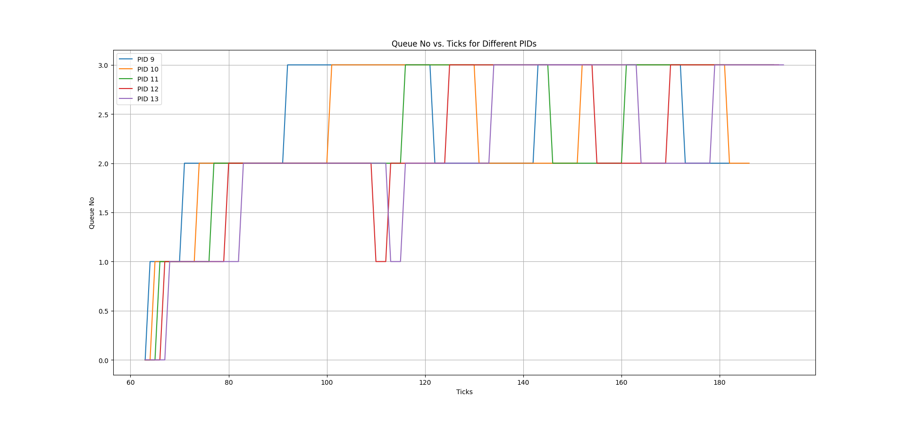

# First Come First Serve(FCFS):

1. In void scheduler function running for loop over 'proc' array and obtaing process with minimun 'ctime' i.e minimum creation time(first arrived process) and storing in 'min_process' and scheduling it.

2. Removed 'yield()' in 'usertrap' and 'kernaltrap' function in trap.c .So that process will run until it no longer needs CPU time.

3. Average runtime: 16 , Waittime : 166

# Multi Level Feedback Queue(MLFQ):

1. First made changes in 'struct proc' :
    1.  inqueuecond : To check if process is present in queue or not.
    2.  cpurtime : CPU runtime of a process in a queue.
    3.  queue_num : Queue number.
    4.  queuetimeslice[4] : To store queue level timeslice.
    5.  queuewaittime : Entry time of process in queue.

2. Implemented Queue functions like push,pop,remove,push_front,etc.

3. Push process in allocproc.

4. In scheduler function in proc.c:
    1. Running a for loop over 'proc' array and pushing all process which are RUNNABLE and not in queue.
    2. Again iterating over 'proc' array and check for process in queue and if its waittime execeeded threshold limit(30)i.e aging then increasing its priority by removing from lower queue and push at back of higher queue.Changing 'cpurtime' to 0 and 'queuewaittime' to ticks.
    3. Now iterating over all queue's starting from highest priority queue and removing process from it and checking for RUNNABLE process ,if obtained a RUNNABLE process then scheduling it.
5. In 'yield()' function updating queuewaittime to ticks.

6. In 'wakeup()' function pushing process in previous queue and changing cpurtime,queuewaittime.

7. In update_time in proc.c function increasing cpurtime.

8. In Usertrap and Kerneltrap function in trap.c:
    1. Iterate over all processes in 'proc' array and check for a process with queue number(i.e priority higher) than current process.
    2. If Higher priority process is obtained then call yield() to schedule it and push current process in front of its queue from which it was removed.
    3. Check for cpuruntime , if current process has execeeded queue time slice then decrease its priority and call yield().

9. Average rtime: 16 , wtime : 163

# Round Robin(RR):

1. Average rtime: 16 ,wtime : 166

# Analysis:

  rtime : RR = MLFQ = FCFS
  wtime : FCFS < MLFQ < RR

